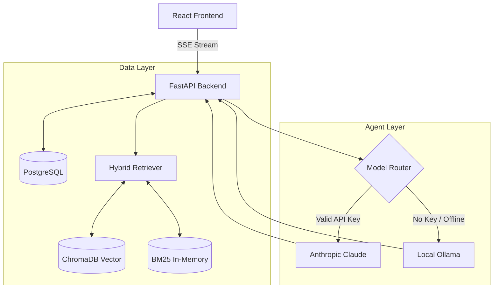

# The Lenny Growth Assistant
*Forward Deployed Engineer Take-Home Assignment*

An AI-powered conversational web application that acts as an expert assistant, strictly grounded in the transcripts of Lenny's Podcast. 

Built with React (Vite), FastAPI, PostgreSQL, and Ollama (local LLM fallback).

---

## 🏗️ Architecture Overview

The system utilizes a hybrid RAG (Retrieval-Augmented Generation) pipeline combining Lexical (BM25) and Semantic (ChromaDB) search to eliminate hallucinations. The backend dynamically routes requests between Anthropic Claude and Local Ollama depending on the user's API key availability.



---

## 📋 Prerequisites

To run the application locally, you must have the following installed:
1. **Node.js** (v18+)
2. **Python** (v3.13)
3. **Docker Desktop** (For running local PostgreSQL via Docker Compose)
4. **Ollama** (Required for local LLM evaluation)

---

## 🚀 Installation & Setup (Local Demo)

Follow these steps to run the application entirely locally on your machine.

### 1. Start the Database
The project includes a `docker-compose.yml` file to spin up PostgreSQL instantly.
```bash
docker-compose up -d
```

### 2. Configure Environment
```bash
cd backend
cp ../.env.example ../.env
```
*(The defaults in `.env.example` are pre-configured to work with the Docker Compose Postgres instance and Local Ollama. You do not need to add a Claude API key to run the local demo.)*

### 3. Backend Setup
In a new terminal window:
```bash
cd backend
python -m venv venv

# Activate venv (Windows)
.\venv\Scripts\activate
# Activate venv (Mac/Linux)
# source venv/bin/activate

pip install -r requirements.txt

# Ingest the sample podcast transcripts into ChromaDB
python scripts/ingest.py

# Start the API server
uvicorn app.main:app --reload --port 8000
```

### 4. Start Local Ollama Model
Since the evaluator brief requires a local LLM demo, ensure Ollama is running and pull the lightweight Llama 3.2 model:
```bash
ollama pull llama3.2:latest
ollama run llama3.2:latest
```

### 5. Frontend Setup
In a new terminal window:
```bash
cd frontend
npm install
npm run dev
```
Navigate to `http://localhost:3000` in your browser. Create a new account (any username/password) to begin!

---

## ☁️ Cloud LLM Setup (Anthropic)

To switch the underlying model to Anthropic Claude (Cloud LLM), you do not need to change any application code.
1. Open the UI at `http://localhost:3000`.
2. Click **Settings** in the top right corner.
3. Paste your `CLAUDE_API_KEY`.
4. The system will automatically detect the key and switch the `ModelProvider` from Ollama to Claude for all future queries.

---

## 🧪 Testing

The backend includes a comprehensive `pytest` suite testing API routing, agent fallback logic, database persistence, and retrieval quality.

```bash
cd backend
pytest tests/
```

### Manual UI Test Plan
1. **Model Fallback**: Submit a message without an API key. Verify the "Ollama" badge appears.
2. **Artifact Generation**: Click the "Ship 30 Essay" button. Verify the Artifact Viewer slides in securely rendering the Markdown.
3. **Theme Switcher**: Click the 🌙/☀️ icon in the header to verify flicker-free light/dark mode CSS variables.

---

## 🛠️ Troubleshooting

- **`ECONNREFUSED 127.0.0.1:5432`**: Docker is not running. Ensure you ran `docker-compose up -d` and Docker Desktop is active.
- **Agent hangs or returns `Connection refused`**: Ollama is not running in the background. Open the Ollama app or run `ollama serve`.
- **Empty citations or "I don't know"**: The transcripts were not ingested. Ensure you ran `python scripts/ingest.py` before starting the server.
